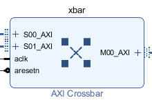
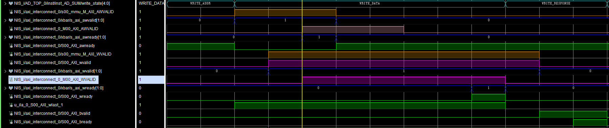
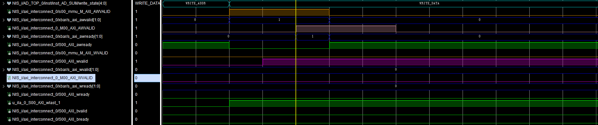
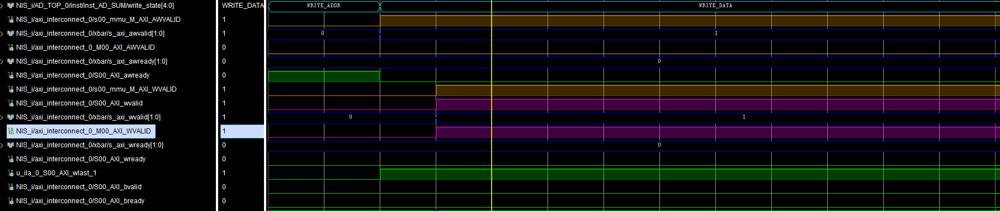

# 背景

本文关注简单axi-interconnect应用：2slave-1master

IP核配置情况如下：

------

# AXI 基础IP核

通过以上IP配置，可以得到如下IP核的展开图

其中couplers所代表为AXI总线直连，那么在上述配置产生的AXI-interconnect主要由两个子IP核构成：

- AXI MMU

  > AXI MMU provides address range decoding and remapping services for AXI Interconnect

  AXI MMU为AXI Interconnect提供地址编码和重映射服务

- AXI Crossbar

  > AXI Crossbar connects one or more similar AXI memory-mapped masters to one or more similar memory-mapped slaves.

  AXI交叉开关（crossbar）为一个或多个类似内存映射的主机到从机提供连接服务。

## AXI Crossbar

​	每个AXI-interconnect都会配置有一个AXI crossbar，其具有如下一些特性：

- 支持最多16个主机和16个从机的连接

- 交叉开关模式（性能优化）

  - **只支持AXI4或AXI3协议**
  - **共享地址**，多数据（hared-Address, Multiple-Data (SAMD)）结构，共享一个写地址仲裁器，共享一个读地址仲裁器

  

  - 写数据通道与读数据通道是并行通路，独立运行
  - 根据连接映射稀疏化交叉开关**数据路径**，减少资源消耗

  

  - 支持多超前传输事务

  

- 共享存取模式（面积优化）

  - **支持任何AXI协议**，通常在AXI4-Lite使用
  - 共享的写入数据、共享的读取数据和单共享地址路径
  - 一次处理一个超前传输事务
  - 读传输请求优先级高于写传输请求
  - 最小资源消耗

  

- 支持固定优先级和轮回查询两种仲裁方式

  - 轮询（round-robin），轮流从各个主机的缓存通道读取事务。
  - 优先级仲裁（priority），优先读取高优先级缓存通道中的事务。

- 支持每个连接的从机信任区安全

### AXI Crossbar 延时

每个仲裁器将会产生2个时钟延时，同一个slave的连续仲裁器将会造成最小3个时钟延时。

|      | cycles of aclk |      | cycles of aclk |
| ---- | -------------- | ---- | -------------- |
| T_AW | 2              | T_W  | 1              |
| T_AR | 2              | T_R  | 1or2           |
| T_WC | 1              | T_B  | 1or2           |

当本次请求的主机和上一次请求的主机不同时，将会发生重新仲裁，由此T_R和T_B的延时将为2

## AXI MMU

​	定义最大到256的地址范围，这些范围代表一个连接的端点主机可以访问的地址空间

## 注意事项

> AXI Interconnect cores do not time out if the destination of any AXI channel transfer stalls indefinitely. All connected AXI slaves must respond to all received transactions, as required by AXI protocol

在任意AXI通道传输被无限期拖延时，AXI-interconnect内核都不会超时。所有的AXI从机都必须响应接收到的传输。

# AXI ID的使用

> **Avoiding Deadlock Using Single Slave Per ID**

为了防止死锁，手册里推荐crosser的每个SI（slave interface）采用独立的ID号，这样当SI在同一时间只会对一个MI（master interface）进行超前传输。另外，MI仍然被允许处理来自多个SI的超前传输事务。

> *AXI protocol provides no means to ensure in-order completion between Write and Read transactions other than waiting for the B-Channel responses of all earlier writes to complete.*

除了等待响应通道的完成，AXI协议没有提供任何方法来确保写和读之间事务的完成。

# 问题实例

数据传输到32次数后出现类似死锁的情况

## 正常时序

## 出现问题时序

**第32次传输：**

​	从图中看出，在第32次传输时axi-interconnect的slave端接收到地址信号，AWVALID和AWREADY均有效；从前面的axi-interconnect内部结构可知，信号流向为：

slave interface ——> mmu——>xbar——>master interface

图中WVALID在slave interface被拉高（紫色），但是mmu对应的信号没有拉高（橙色），并一直保持低。而程序中设置了看门狗，当信号长时间没有响应（4096个时钟），总线信号全部进行复位。

**第33次及其后续**

由于在axi协议强调，**通信双方都不能在传输事务的所有 Transfer 完成前提前结束**，看门狗的触发将引发axi协议出错，导致后续的传输无法进行，具体体现为：

写地址总线上的AWREADY无法响应，写数据总线上WREADY无法响应。 